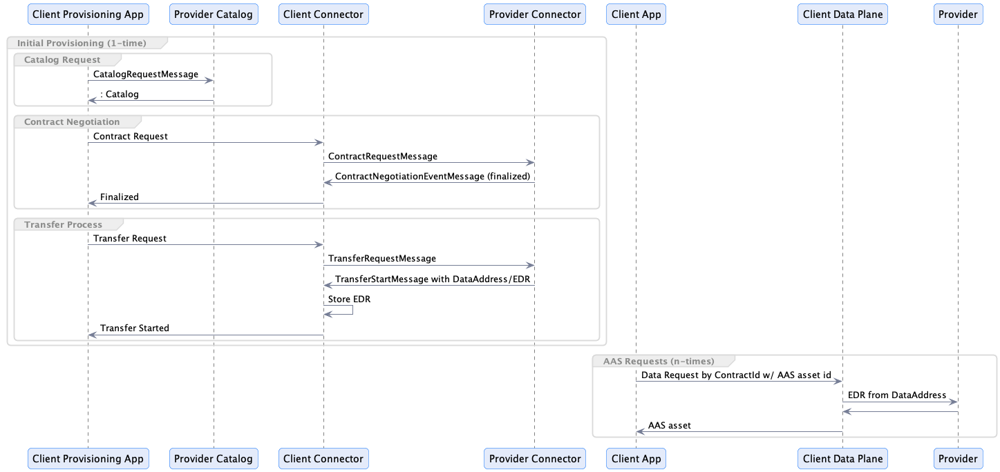

# Technical Specification for Applying IDS Usage Control to AAS data

This document is a technical specification for enabling IDS usage control with AAS. Its goals are to define an AAS-IDS integration that:

1. Codifies best-practices for modelling AAS submodels as IDS datasets.
2. Promotes network-wide interoperability by defining how IDS datasets and endpoint information is conveyed in AAS submodel descriptors.

It is **not** a goal of this specification to address syntactic or semantic interoperability of AAS submodels.

> An IDS dataset is equivalent to an EDC asset.

## IDS Dataspace Protocol Design Principles

The IDS Dataspace Protocol and IDS define the following constructs:

- **Dataset Catalog** - A set of participant data and usage policies that can be shared with another participant
- **Contract Negotiation Process** - The process of establishing a contract agreement governing usage policy between two dataspace participants for an asset
- **Data Transfer Process** - A data connection between two participants based on a contract agreement. The connection may be logical (e.g. there is no physical socket or other
  compute resources dedicated to it). Furthermore, a data transfer process is only associated with a single asset.
- **Data Plane** - A technical system tasked with providing access to the data for an asset. A data plane will typically be responsible for transferring data from one participant
  to another using a wire protocol.

One of the fundamental IDS design tenets is that contract negotiations and transfer processes **should be** established up front whenever possible. Let's start with
sharing machine learning data, where upfront setup is not critical. A client participant engages in the following steps:

1. Access a provider catalog
2. Select a dataset
3. Initiate a contract negotiation for the dataset that concludes with a contract agreement
4. Initiate a transfer process
5. The transfer process engages a data plane to transfer the data to the client

In this case, there is a 1..1 correspondence between a contract negotiation and the data transmitted. While a second transfer process could be initiated based on the same contract
agreement, the transferred data would be the same. **This data sharing scenario should be seen as the exception, not the rule**. In the case of machine learning, data sets are
typically large, and the time associated with conducting a contract negotiation vs transferring the data is not significant.

There are much more common classes of data where this is not the case. Consider financial market data or weather data that changes daily or on an intraday basis. In these
scenarios, it would be impractical to initiate a contract negotiation for each data period that is accessed. Like a socket connection in network programming, the cost of contract
negotiation and establishing a transfer process can be performed upfront and amortized over the duration of continual data access. In the case of a market data feed, a participant
may conclude a single contract agreement and leave a transfer process open indefinitely while it accesses the market feed on a daily basis to obtain updates.

> In IDS, a single contract negotiation can be conducted upfront and transfer processes remain active for an indefinite timeframe, while a data stream is accessed on a periodic
> basis. This is referred to as a non-finite data transfer. EDC makes non-finite data transfers cheap from a resource perspective, and they should be favored whenever possible.

AAS data will be modelled based on this approach.

## The AAS Metamodel and IDS Datasets

### AAS Assets

AAS is a metamodel and API for defining and conveying digital representations of an asset. AAS defines an asset as a broad range of business elements, including factories,
production systems, equipment, machines, components, produced products and raw materials, business processes and orders, etc.

An **AAS asset** may be a composition (i.e. contain other assets) and have more than one representation (submodel). As a metamodel, AAS includes the concepts of `instance`
and `type` defined as a `kind`. The AAS metamodel can be expressed as a hierarchical graph with `contains` and `derivedFrom` edges.

### IDS Datasets

An **IDS dataset** represents data that can be shared with other dataspace participants. An IDS dataset:

- is associated with 1..N **offers**.
- may include 0..N data "parts" such as messages, files, or archives
- may include a finite or infinite set of data that is not temporarily bound

### Attaching IDS Dataset to the AAS Metamodel

There are two practical ways to model the relationship between IDS datasets and AAS assets:

1. An IDS dataset has a 1..1 relationship with an AAS asset.
2. An IDS dataset has a 1..N relationship with an AAS asset.

In cases where there are many AAS assets, Option 1 is suboptimal since it requires a contract negotiation for each AAS request. Option 2 allows a single IDS dataset to represent
more
than one AAS asset, which aligns with having one contract negotiation and transfer process span many AAS requests. The latter approach should be preferred unless there is a
compelling business requirement to do otherwise.

#### The IDS Endpoint and `protocolInformation` type

The association between IDS datasets and AAS assets will be made available in an AAS Registry using IDS-specific `protocolInformation` entry for an endpoint in an asset
or submodel descriptor. With this method, it is possible to support either of the two modelling approaches specified in the previous section. In the case where the association is
1..N, the endpoint and `protocolInformation` entry can be included in the POSTed AAS descriptor, or the AAS Registry may include an implementation-specific mechanism for
defining endpoint and `protocolInformation` entries for a category of AAS types.

The following is an example of an endpoint entry with IDS `protocolInformation`:

```json
{
  "protocolInformation": {
    "endpointAddress": "https://test.com/catalog",
    "endpointProtocolVersion": "0.8",
    "subprotocol": "Dataspace Protocol Specification 0.8",
    "subprotocolBody": "dataset=79afc338-f7ea-4255-a17d-ba6faf40d2b5",
    "subprotocolBodyEncoding": "json-ld"
  },
  "interface": "DSPACE-0.8"
}
```

| Attribute               | Type   | Description                                                                                                                 |
|-------------------------|--------|-----------------------------------------------------------------------------------------------------------------------------|
| endpointAddress         | URL    | The URL must point to an endpoint that implements the IDS Catalog Protocol. Currently, only the HTTPS binding is supported. |
| endpointProtocolVersion | string | The IDS protocol version supported by the endpoint.                                                                         |
| subprotocol             | string | The IDS protocol description.                                                                                               |
| subprotocolBody         | string | A string in the form `dataset=`, which must contain the IDS dataset id the AAS asset is mapped to.                          |
| subprotocolBodyEncoding | string | Currently, only `json-ld` is supported.                                                                                     |
| interface               | string | The protocol and version, currently `DSPACE-0.8`.                                                                           |

Note the `endpointAddress` references the IDS catalog endpoint, not the actual data endpoint. The propagation of the data endpoint is handled by the IDS protocol and detailed in
the next section.

## Runtime Operation

Runtime operation is divided into two steps, _Initial Provisioning_ and _Requests_ as depicted in the following sequence diagram:



The Initial Provisioning step is performed once to discover IDS datasets, establish one or more contract negotiations, and start one or more transfer processes. When the transfer
processes are started, the provider connector will send a start messages containing an IDS `dataAddress` (an EDC EDR). The data addresses will be stored by contract id and made
available to the `DataPlane`. The transfer processes are non-finite and will remain in the STARTED state indefinitely.

At this point, a Client App can issue requests for AAS assets by interacting directly with the `DataPlane` and providing the associated contract id and AAS asset id. Note that
obtaining the contract id may require resolving and selecting one or more contract ids by IDS dataset id (obtained from the AAS Registry). The IDS dataset id alone is not
sufficient since more than one contract may exist for a given asset. The `DataPlane` will resolve the EDR associated with the contract id and route the request to the correct
provider connector.

> Note that the above architecture requires a small, custom data plane API. This API will be implemented as an EDC Data Plane extension. It will be possible to support the same
> API in a custom data plane implementation.

### RBAC Security

The provider can implement granular security as part of each AAS asset request. This could be performed by a provider `Data Plane` via its `PolicyEngine` or by a backend system
that serves AAS assets.  


